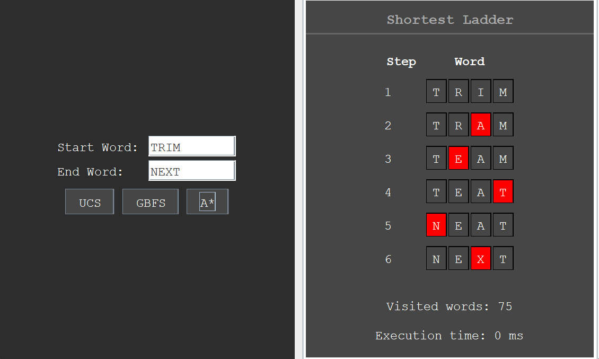

<h1 align="center"> Tugas Kecil 3 IF2211 Strategi Algoritma</h1>
<h1 align="center">  Penyelesaian Permainan Word Ladder Menggunakan Algoritma UCS, Greedy Best First Search, dan A* </h1>

## Identitas Pengembang Program
- **Nama: Derwin Rustanly**
- **NIM : 13522115**
- **Kelas : K1**
## Deskripsi Program
Word ladder (juga dikenal sebagai Doublets, word-links, change-the-word puzzles, paragrams, laddergrams, atau word golf) adalah salah satu permainan kata yang terkenal bagi seluruh kalangan. Word ladder ditemukan oleh Lewis Carroll, seorang penulis dan matematikawan, pada tahun 1877. Pada permainan ini, pemain diberikan dua kata yang disebut sebagai start word dan end word. Untuk memenangkan permainan, pemain harus menemukan rantai kata yang dapat menghubungkan antara start word dan end word. Banyaknya huruf pada start word dan end word selalu sama. Tiap kata yang berdekatan dalam rantai kata tersebut hanya boleh berbeda satu huruf saja. Pada permainan ini, diharapkan solusi optimal, yaitu solusi yang meminimalkan banyaknya kata yang dimasukkan pada rantai kata. Berikut adalah ilustrasi serta aturan permainan. 

Repositori ini berisi implementasi penyelesaian permainan word ladder dengan menggunakan algoritma UCS, Greedy Best First Search dan A* dengan bahasa pemrograman Java


## Setup dan Requirements Program
1. Java Development Kit (https://www.oracle.com/id/java/technologies/downloads/#java8)

## Cara Menggunakan Program
1. Silahkan clone repositori ini dengan menjalankan perintah berikut
    ```
    git clone https://github.com/DerwinRustanly/Tucil3_13522115
    ```

2. Masuk ke root directory program
    ```
    cd Tucil3_13522115
    ```

3. Untuk pengguna Windows, jalankan perintah berikut pada terminal
    ```bash
    ./run-solver.bat
    ```

4. Untuk pengguna MacOS/Linux, jalankan perintah berikut pada terminal
    ```bash
    chmod +x compile_and_run.sh
    ./run-solver.sh
    ```

# Dokumentasi Program

